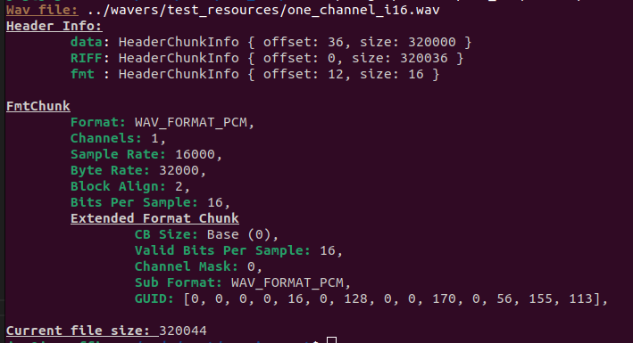

# Wav-Inspect
A tool for inspecting the header of a ``wav`` file. This tool uses [WaveRs](https://github.com/jmg049/wavers) to get the header information.

Soon to be cargo installable!

## Usage
``wav_inspect <file_name>``

### Sample Output

